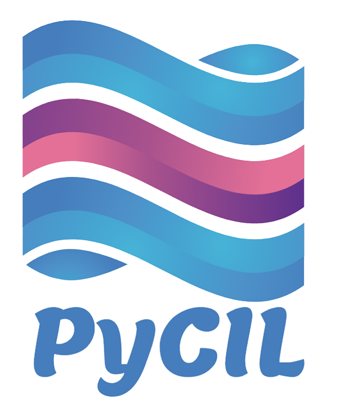

.. diary documentation master file, created by
   sphinx-quickstart on Sat Oct 10 22:31:33 2020.
   You can adapt this file completely to your liking, but it should at least
   contain the root `toctree` directive.

PyCIL: A Python Toolbox for Class-Incremental Learning
=================================

.. contents::
   :maxdepth: 2
   :caption: Contents:

   Welcome
   News
   Introduction
   Methods Reproduced
   Reproduced Results
   How To Use
   Awesome Papers Using PyCIL
   Explanation Of Main Codes
   Explanation Of Some Methods
   Lisense
   Acknowledgements
   Contact
   Star History

